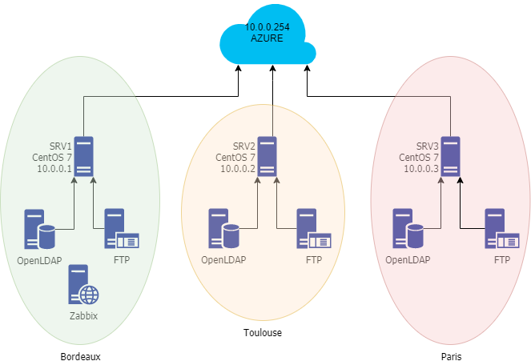

# Mise en place d'une infrastructure virtualisée, redondée et sauvegardée.

## Résumé

Dans le cadre du cours Open Source, réalisation d'un projet :
Mise en place d'une infrastructure avec déploiement automatisé de machines virtuelles, avec une configuration automatisée des services qui y sont déployé et redondé, associés à une sauvegarde des données de ces machines virtuelles.

## L'équipe

Etant tous issus de milieu differents, nous avons chacun aquis divers connaissances que nous avons souahité mettre en commun pour la realisation ce TP.

Notre équipe est composé de tois adminstrateurs systèmes et réseaux, Paulin, Dylan et Maxence, et d'un DevOPS Lukas .
Nous connaissons les contraintes et les besoins à laquelle une entreprise composé de plusieurs sites peut être confronté.

C'est avec cette équipe de charros que nous avons décidé de vous présenter un projet d'infrastrcuture redondée et sauvgardée.

## Le projet

Nous avons décidé de partir sur un cas de figure que des entreprises peuvent rencontrer, le cas d'une entreprise possédant un siege dans une ville et de deux autres sucursalles d'autres villes.

Dans notre cas de figure la configuration est la suivante:

L'entreprise est composée de 3 sites : 
  - Bordeaux :  Site principale
  - Toulouse :  Succursale n°1
  - Paris    :  Succursale n°2

Nous avons également un VPS chez OVH pour assurer une fonction de sauvgarde des donneés.
Tel que le ferais n'importe quelle entreprise pour externaliser ses données.

Les trois serveurs de production seront hébergées sur la plateforme Microsoft Azure.

A l'aide de l'offre étudiante Ynov, nous bénéficions d'un crédit de 100$ pour utiliser cette plateforme.

L'infrastrucure comprend plusieurs serveurs : 

- 3 serveurs avec les services suivants :
  - OpenLDAP
  - FTP
  - Zabbix (monitoring de l'infrastructure)
  
Le déploiement de ces 3 serveurs sera automatisé via Vagrant, un connecteur pour la plateforme Azure est disponible. Tous les paramêtres seront configurés via cet outil.

Le modèle de ces serveurs est le Standard_F2sv2, avec comme configuration : 
  - 4 GO de RAM
  - 2 vCPU
  - 1 NIC
  - 4 HDD
  
   
  1 serveur sera disposé sur chaque site.

Afin de faciliter et d'optimiser le déploiement de l'infrastructure, la configuration de l'ensemble des services sera effectuée via Ansible.

Ansible permettra la configuration automatique des 3 serveurs : 

Configuration du serveur LDAP : 
  - Configuration générale :
    - Domaine
    - Identifiants Administrateur
    - Création des utilisateurs
    
Configuration du serveur FTP : 
  - Configuration générale :
    - Partages
    - Utilisateurs
    - Droits d'accès
    
Configuration du serveur Zabbix : 
  - Configuration générale :
    - Création des hôtes à surveiller
    - Création des alertes/notifications
    - Création des utilisateurs
    
    
## Commandes de base

vagrant up --no-parallel

## Nommage des serveurs

SRV1.loscharros.com
  - OpenLDAP
  - FTP
  - Zabbix
    
SRV2.loscharros.com
  - OpenLDAP
  - FTP
    
SRV3.loscharros.com
  - OpenLDAP
  - FTP

## Configuration réseau

Le plan d'adressage sera :

10.0.0.0/24 

Les serveurs seront configuré en IP statique.
La connexion SSH sera activée sur ces serveurs.

Domaine : loscharros.com 

Gateway : 10.0.0.254

SRV1 : 10.0.0.1 (Bordeaux)

SRV2 : 10.0.0.2 (Toulouse)

SRV3 : 10.0.0.3 (Paris)

Tous les serveurs de production seront dans le même VLAN.
Le serveur privé ayant une adresse IPV4 publique.

Le meilleur projet, par LOS CHARROS. <3

